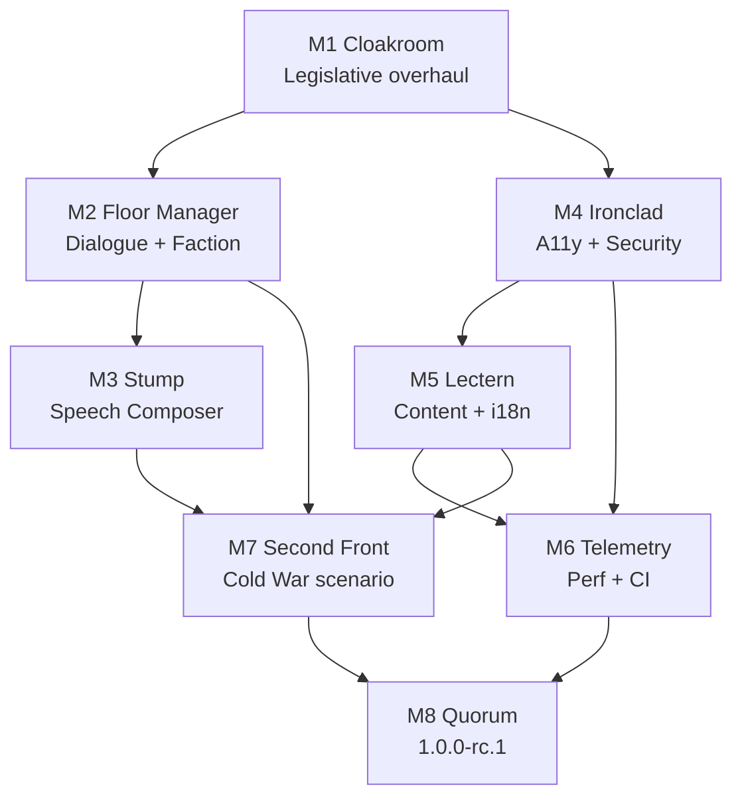

# Political Ascent — Development Roadmap

**Status:** v0.4-DRAFT (aligned with [GDD.md](GDD.md) v0.4-DRAFT)
**Current version pin:** `0.1.0-alpha.1-exp.20260429` (see [package.json](../package.json))
**Active branch:** `exp--legislative-overhaul`
**Companion docs:** [GDD.md](GDD.md) · [ARCHITECTURE.md](ARCHITECTURE.md) · [SCENARIO_PLAN.md](SCENARIO_PLAN.md) · [about/CHANGELOG.md](about/CHANGELOG.md)

> The previous milestone-by-feature roadmap is archived as `ROADMAP.md.bak` for history. This rewrite reframes work around versioned milestones derived from the GDD system inventory (§4) and the Phase 4 backlog gaps reported by Sol/Vex/Rook in §13/§14.

---

## 1. Overview — release-stream model

Political Ascent ships through three release streams. Each stream maps to a long-lived branch, a folder under [docs/changelogs/](changelogs/), and a tab in the in-game **Patch Notes** panel.

| Stream | Branch | Audience | Stability bar | Cadence |
|---|---|---|---|---|
| **development** | `development` | Internal devs, automated nightly | Permitted to be temporarily red. Promotion gate is "compiles + boots". | Continuous. Feature branches `exp--<slug>` merge here first. |
| **experimental** | `experimental` | Opt-in playtesters, pre-release tags | Green required gates per §13.7.1. May contain partial systems behind flags. | Per-feature pre-release tag (e.g. `v0.2.0-exp.YYYYMMDD`). |
| **stable** | `release` (or `stable`) | Public players | All §13.7.1 gates green, including the experimental→stable column. | Milestone-aligned (see §4). No fixed wall-clock cadence. |

A feature flows **development → experimental → stable**. It cannot skip a stream.

---

## 2. Versioning policy

Semantic versioning, adapted for a single-player game.

| Component | Bumped when… |
|---|---|
| **MAJOR** (`X.0.0`) | Save-incompatible redesign of a core loop, persisted-state schema break without migration, or a stable storefront release boundary. `1.0.0` is the first publicly committed-to balance. |
| **MINOR** (`0.X.0`) | New system, new scenario, new panel, or any user-visible content addition. Migrations are required if persisted state changes (§5.3). |
| **PATCH** (`0.0.X`) | Bug fix, balance tweak, content polish, doc-only change. No persisted-state schema change. |
| **Pre-release suffix** | `-alpha.N`, `-beta.N`, `-rc.N` for stable lane; `-exp.YYYYMMDD` for experimental tags; `-dev.<short-sha>` for development snapshots. |

### 2.1 Stream → folder → file mapping

| Event | Stream folder | Filename pattern |
|---|---|---|
| Feature merged to `development` | [docs/changelogs/development/](changelogs/development/) | `YYYY-MM-DD-<version>-<slug>.md` |
| Tag cut on `experimental` | [docs/changelogs/experimental/](changelogs/experimental/) | `YYYY-MM-DD-<version>-<slug>.md` |
| Stable release tag | [docs/changelogs/stable/](changelogs/stable/) | `YYYY-MM-DD-<version>.md` |
| Canonical user-facing summary | [docs/about/CHANGELOG.md](about/CHANGELOG.md) | Keep-a-Changelog 1.1.0 layout, stable-only entries |

Promotion gates are defined in GDD §13.7.1. The two columns (development→experimental and experimental→stable) are the contract — this roadmap does not duplicate them, it cites them.

---

## 3. Current state

| Field | Value |
|---|---|
| Last shipped tag | `v0.1.0-alpha.1` (development stream, 2026-04-24) |
| Most recent pre-release | `v0.1.0-alpha.1-exp.20260429` (experimental, Android APK) |
| In-flight branch | `exp--legislative-overhaul` (M1 below) |
| Stable releases | None — pre-alpha. First stable target: `1.0.0-rc.1` (M8). |

**Shipped systems (per GDD §4.0):** LegislationSystem, CongressSystem, EconomySystem, PopulationSystem, EventEngine, CardSystem, CharacterSystem, QuestSystem, AchievementEngine, InfluenceSystem, SkillSystem (partial), DialogueSystem (scaffolded, no UI). Save schema v1.

**Known-incomplete systems (per GDD §4.11, §4.12, §12):** ReputationSystem/FactionSystem (designed, partial), DialogueSystem UI, SpeechSystem (designed, no module), audience-segment data, news headline templates, trait JSON migration, card flavour pass.

---

## 4. Milestones

Each milestone references the gates in [GDD.md §13.7.1](GDD.md). Exit criteria at minimum require the development→experimental column; promotion to stable requires the second column.

### M1 — Legislative Overhaul *(active, branch `exp--legislative-overhaul`)*

| Field | Value |
|---|---|
| **Code name** | Cloakroom |
| **Target version** | `0.2.0-alpha.1` |
| **Theme** | Make the bill lifecycle the most legible system in the game. |
| **Scope (GDD)** | §4.1 LegislationSystem · §4.2 CongressSystem · §2.2 Time scale · Sol §14.1 backlog: VotingSystem extraction, persisted quest day, budgetReconciliation hook |
| **Concrete deliverables** | Rider stack on `Bill`; day-indexed legislative clock; expedite cost surface in DraftLegislationScreen; voting logic extracted from CongressSystem into VotingSystem; persisted `quest.startedDay`; legislative news headlines for stage transitions. |
| **Gates** | §13.7.1 dev→exp column. New CongressSystem/VotingSystem unit tests required (§13.1.1). Schema bump → migration ladder entry per §13.3.3. |
| **Exit criteria** | Player can draft → committee → floor → vote → sign/veto a bill end-to-end with rider stack visible; save round-trip preserves day-indexed clock; VotingSystem has its own test file ≥80% line coverage. |

### M2 — Dialogue v1 & Faction Foundation

| Field | Value |
|---|---|
| **Code name** | Floor Manager |
| **Target version** | `0.3.0-alpha.1` |
| **Theme** | Convert two scaffolded systems (Dialogue, Faction) into shipped UI surfaces. |
| **Scope (GDD)** | §4.11 ReputationSystem/Faction · §4.12 DialogueSystem · §12.5 Dialogue Authoring Guide · Vex §12 backlog: dialogue UI, FactionSystem unimplemented, scenario.victoryText/lossText |
| **Concrete deliverables** | DialogueSystem renderer panel + node interpreter; FactionSystem module with persisted standings; `scenario.victoryText` / `scenario.lossText` in scenario schema; save schema v2 with migration from v1 (§13.3.3); first authored dialogue sequence wired into a quest beat. |
| **Gates** | §13.7.1 dev→exp. Save fixture corpus from M4 not yet required, but a v1→v2 migration test is required before the schema bump merges. |
| **Exit criteria** | A new game can enter a dialogue node, choose an option, see a stat write, and exit; faction standings persist across save/load; both `victoryText` and `lossText` render at end-of-run. |
| **Dependency** | Requires M1 (no schema collision). |

### M3 — Speech Composer & Audience Segments

| Field | Value |
|---|---|
| **Code name** | Stump |
| **Target version** | `0.4.0-alpha.1` |
| **Theme** | Ship the headline RPG-layer expression mechanic. |
| **Scope (GDD)** | §12.6 Speech Composer Content · §12.6.4 audience-fit scoring · §12.6.6 news headline templates · §4.4 PopulationSystem (audience segment priorities) · Vex §12 backlog: SpeechSystem missing, news headline templates, audience segment data |
| **Concrete deliverables** | SpeechSystem module; rhetorical-device data file (§12.6.2); phrase fragment data shape (§12.6.3); audience-segment priority data attached to PopulationGroup; news headline templates JSON consumed by SpeechSystem and EventEngine; Speech Composer UI screen. |
| **Gates** | §13.7.1 dev→exp. String-content lint (§13.1.2) hooked into the new headline-template file. |
| **Exit criteria** | Player can compose a speech, see an audience-fit score, deliver, and read a news headline whose tone reflects the score. |
| **Dependency** | Requires M2 (Faction standings consumed as a speech audience signal). |

### M4 — Quality, A11y & Security Hardening

| Field | Value |
|---|---|
| **Code name** | Ironclad |
| **Target version** | `0.5.0-alpha.1` |
| **Theme** | Close every Rook §13 gap before content scope expands further. |
| **Scope (GDD)** | §13.1 test pyramid · §13.2 determinism · §13.3 save round-trip · §13.4 a11y · §13.5 security · §13.9 ErrorBoundary policy · Rook §13 backlog: no axe integration, no CSP, no save-fixture corpus, no IPC fuzz tests, no Date.now lint, no console.log lint, no .nvmrc, no nested ErrorBoundary |
| **Concrete deliverables** | Playwright + axe wired into `a11y-scan` pipeline (§13.8); CSP meta tag + main-process `session.webRequest` headers; save fixture corpus under `src/test/fixtures/saves/` with v0→v1 migration coverage; IPC fuzz harness for `pa:save:*` and `pa:settings:*`; ESLint rules forbidding `Date.now()` and `console.log` outside test/dev paths; `.nvmrc` pinning Node 20 LTS; nested ErrorBoundary at the panel boundary (§13.9.1). |
| **Gates** | §13.7.1 dev→exp **and** the experimental→stable a11y / security columns must be exercisable end-to-end (even if not yet fully green). This milestone is what makes the second column reachable. |
| **Exit criteria** | `pr-validate`, `a11y-scan`, and `security-scan` pipelines all run on PR. Axe scan returns no critical/serious. Save fixture corpus has at least 5 fixtures and the "every save can be loaded" gate is real CI, not aspirational. |
| **Dependency** | Should land before M5 content work because the lint and fixture corpus catch authoring regressions cheaply. |

### M5 — Content & Localisation Foundations

| Field | Value |
|---|---|
| **Code name** | Lectern |
| **Target version** | `0.6.0-alpha.1` |
| **Theme** | Move authored content out of TS source and prepare for translation. |
| **Scope (GDD)** | §4.7 Character (traits) · §4.6 Cards (flavour) · §5.4 Static game data · §12.1 Tone Bible · Sol §14.1 backlog: trait JSON finish, card hand drawer · Vex §12 backlog: trait JSON migration, card flavour pass · `scenario.victoryText/lossText` (carries over from M2 if deferred) |
| **Concrete deliverables** | Traits fully migrated from inline TS to `src/data/traits/*.json` with schema validation; card flavour pass for every shipped card; i18n scaffolding (string-bundle module + locale-aware formatter) without committing to a second locale yet; humanise dictionary moved into the locale bundle. |
| **Gates** | §13.7.1 dev→exp. String-content lint (§13.1.2) extended to traits and card flavour. |
| **Exit criteria** | Zero trait or card flavour strings live in TS source. A locale bundle exists with `en-US` populated; switching locales at runtime is plumbed even if no second locale ships. |
| **Dependency** | Requires M4 (lint extensions catch authoring drift). |

### M6 — Performance & CI Maturity

| Field | Value |
|---|---|
| **Code name** | Telemetry |
| **Target version** | `0.7.0-alpha.1` |
| **Theme** | Make performance a tracked artefact, not a vibe. |
| **Scope (GDD)** | §11 Performance Targets · §13.6 Performance Verification · §13.8 CI Pipelines · Rook §13 backlog: no bench/, no .nvmrc (carry-over check from M4) |
| **Concrete deliverables** | `bench/` directory with the perf fixtures from §13.6.3 (1-week, 13-week, 52-week, 5-year); hard-gate harness wired into `pr-validate`; soft-gate harness wired into `nightly-soak`; bundle-size budget enforced; branch protection enabled on `experimental` and `stable` per §13.8.1. |
| **Gates** | Both columns of §13.7.1 must be runnable in CI by milestone exit, even if some soft gates are still amber. |
| **Exit criteria** | `nightly-soak` runs at 03:00 UTC and posts a green or red status. Perf hard-gates block PRs that regress. Branch protection is real, not documented-only. |
| **Dependency** | Requires M4 (CI scaffolding) and benefits from M5 (stable content for fixture stability). |

### M7 — Scenario Expansion

| Field | Value |
|---|---|
| **Code name** | Second Front |
| **Target version** | `0.8.0-alpha.1` |
| **Theme** | Validate that the engine actually supports a second scenario. |
| **Scope (GDD)** | §12.7 Per-Scenario Narrative Briefs · [SCENARIO_PLAN.md](SCENARIO_PLAN.md) |
| **Concrete deliverables** | One additional scenario from §12.7 — recommended pick: **Cold War (1947–1991)** because it reuses the modern Congress shape with new factions, lowering engine risk while exercising FactionSystem (M2) and SpeechSystem (M3) under different audience priors. Full data bundle: `scenario.json`, `legislators.json`, `population.json`, `economy.json`, scenario-specific events, narrative brief assets per §12.7.2. |
| **Gates** | §13.7.1 dev→exp. New scenario must round-trip through save fixture corpus. |
| **Exit criteria** | Player can pick the new scenario from Scenario Select, play through one full beat of its featured arc, and reach either victory or loss text. |
| **Dependency** | Requires M2 (Faction), M3 (Speech), M5 (i18n data shape) so authored content lands in the right places the first time. |

### M8 — First Stable Candidate

| Field | Value |
|---|---|
| **Code name** | Quorum |
| **Target version** | `1.0.0-rc.1` |
| **Theme** | Pass every gate in the experimental→stable column of §13.7.1. |
| **Scope (GDD)** | §13.7 entire · §14 risks reviewed · [wiki/Release-Notes.md](wiki/Release-Notes.md) updated |
| **Concrete deliverables** | Manual a11y checklist signed off; performance soft-gates green; Electron Win/macOS/Linux smoke; Capacitor Android smoke; CodeQL clean; signed binaries; `docs/changelogs/stable/<date>-1.0.0.md` written; Wiki release notes updated; GDD §14 risk list reviewed and any new entries triaged. |
| **Gates** | Both columns of §13.7.1 fully green. No exceptions; an amber gate blocks the tag. |
| **Exit criteria** | `1.0.0-rc.1` tag pushed; if no P0/P1 surfaces in the RC window, promote to `1.0.0`. |
| **Dependency** | Strictly serial after M6 and M7. |

### 4.1 Milestone ladder (one-line summary)

| # | Version | Code name | Theme |
|---|---|---|---|
| M1 | `0.2.0-alpha.1` | Cloakroom | Legislative overhaul |
| M2 | `0.3.0-alpha.1` | Floor Manager | Dialogue v1 + Faction foundation |
| M3 | `0.4.0-alpha.1` | Stump | Speech Composer + audience segments |
| M4 | `0.5.0-alpha.1` | Ironclad | A11y + security + test/lint hardening |
| M5 | `0.6.0-alpha.1` | Lectern | Trait JSON + card flavour + i18n scaffolding |
| M6 | `0.7.0-alpha.1` | Telemetry | Perf gates + CI maturity |
| M7 | `0.8.0-alpha.1` | Second Front | Cold War scenario |
| M8 | `1.0.0-rc.1` | Quorum | First stable candidate |

**Justification for ordering:** M4 deliberately precedes M5/M7 because the lint extensions and save fixture corpus catch content-authoring regressions cheaply — landing those rules after a content sprint multiplies cleanup cost. M6 follows M5 so perf fixtures stabilise against shipped content, not against in-flux content.

---

## 5. Dependency graph

---

## 6. Out of scope (deferred)

The following are explicitly **not** on the path to `1.0.0`. They are tracked for post-1.0 consideration but do not block any milestone above.

| Item | Reason for deferral | Tracked in |
|---|---|---|
| Regional cohort granularity / Web Worker reeval | Sol §14.1 flagged but performance budget (§11) not yet limiting | GDD §14.2 |
| Multiplayer (co-op or competitive) | Out of scope per §1.2 non-goals | GDD §1.2 |
| Mod marketplace / Steam Workshop | Mod loader sandboxing is a 1.x topic | GDD §13.5.5, §9 |
| Mobile companion app | No engine fit at 0.x | — |
| Character portrait generator / illustrated card art | §2.9 of AGENTS.md forbids AI-generated portraits at this stage | AGENTS.md §2.9 |
| Full audio implementation (score + SFX) | §1.2 non-goal for MVP | GDD §1.2 |
| Network telemetry / crash reporting | §13.5.6 requires policy that doesn't exist yet | GDD §13.5.6 |
| Parliamentary / authoritarian alt-systems | Different core loop, not a scenario reskin | — |

---

## 7. Risks & assumptions

| Risk | Likelihood | Impact | Mitigation |
|---|---|---|---|
| Save schema bumps in M1 + M2 + M5 collide if order slips | Medium | High (data loss for testers) | Migration ladder per save-bump (§13.3.3); fixture corpus from M4 catches regressions retroactively. |
| FactionSystem design (§4.11) is still partial — M2 may surface unresolved questions | Medium | Medium | Reserve a decision pass at M2 kickoff; defer reputation-side mechanics if blocked. |
| Performance fixtures (M6) drift if content (M5) keeps changing | Medium | Low | Lock content freeze for M6 fixture authoring; rebuild fixtures only on intentional content snapshots. |
| Cold War scenario (M7) reveals engine assumptions baked to modern-america-2024 | High | Medium | Treat M7 as the engine generality test; budget refactor headroom inside M7, not after it. |
| Stable promotion stalls on manual a11y checklist (§13.4.3) | Medium | Medium | Run the checklist informally at end of M5 and M6 to surface issues early, not at M8. |
| Codex-driven content drift introduces non-deterministic strings | Low | Medium | String-content lint (§13.1.2) blocks at PR. |

**Assumptions:**
1. Solo or near-solo development cadence — milestones are scoped to be deliverable as a single coherent stream, not parallel tracks.
2. No external publisher deadline. Milestones are gated by readiness, not calendar.
3. Capacitor Android remains a supported target through 1.0; if it is dropped, M4 and M8 smoke columns shrink accordingly.

---

*Roadmap derived from [GDD.md](GDD.md) v0.4-DRAFT.*
*Milestone scope is fixed; sequencing may shift if dependencies reorder.*
